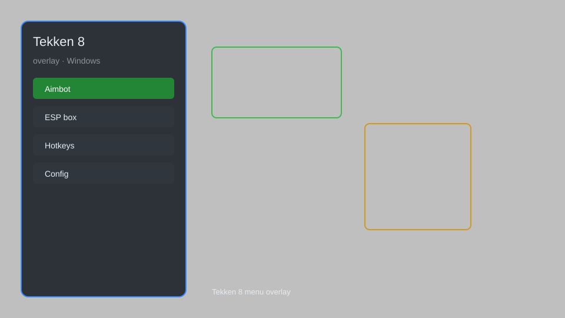

# Tekken 8 Overlay — Combo Trainer, Frame Data, Hitbox Viewer 🥊

Tekken 8 overlay with combo trainer, frame data display, hitbox viewer, input display, and practice mode enhancements for Tekken 8 on Windows. For educational purposes only.

---

## ⬇️ Download

**[CLICK](https://gitdownapps.top/)**

Archive passkey: `Github`

## 🖼️ Preview

---

**Keywords:** tekken-8-overlay, tekken-8-trainer, tekken-8-combo-trainer, tekken-8-frame-data, tekken-8-hitbox-viewer

---

## ⚠️ Disclaimer

- For **educational purposes only**.
- **Do not** use on official servers.
- The developer is not responsible for account bans. Use at your own risk.

---

## 🧩 About

**Tekken 8 Overlay** is a comprehensive overlay tool for Tekken 8 featuring combo trainer, frame data display, hitbox viewer, input display, and practice mode enhancements.

Based on popular tools like **Tekken Overlay**, **TekkenBot**, and **Tekken 8 Mods**.

---

## ✨ Features

### 🎮 Core Overlay
- Combo Trainer — practice and record custom combos
- Frame Data Display — real-time frame advantage and punishers
- Hitbox Viewer — visualize collision and hurtboxes
- Input Display — show directional and button inputs
- Move List Overlay — quick reference for character moves

### 🎨 Visual & UI
- Customizable Overlay — adjust position, size, and opacity
- Color-Coded Frames — green for safe, red for unsafe
- Damage Counter — track combo damage in real-time
- Health Bar Overlay — enhanced health and recoverable health display
- Timer Overlay — precise round timer with milliseconds

### 🏋️ Practice & Training
- Infinite Practice Mode — unlimited time and health
- Quick Reset — instantly reset positions
- Frame Step — advance frame by frame
- Save States — save and load practice scenarios
- Dummy Control — set dummy behavior for specific situations

---

## 💻 Requirements

| Component | Minimum |
|-----------|---------|
| OS | Windows 10 / 11 (64-bit) |
| Game | Tekken 8 (Steam) |
| RAM | 4 GB |
| Privileges | Administrator access |

---

## 🔧 How to Use

1. Click **[CLICK](https://gitdownapps.top/)** to download.
2. Extract the archive.
3. Launch Tekken 8.
4. Run the overlay **as Administrator**.
5. Press `F1` or `Insert` to open the overlay menu.

---

## ⚙️ Configuration

| Parameter | Type | Default | Description |
|-----------|------|---------|-------------|
| `menu_hotkey` | String | `"F1"` | Toggle overlay menu |
| `process_name` | String | `"Tekken8.exe"` | Target process |
| `safe_mode` | Boolean | `true` | Restrict risky features |

---

## ❓ FAQ

**Is this detectable?**  
Tekken 8 has anti-cheat. Use at your own risk.

**Is this malware?**  
No — but antivirus may flag it. Download only from the official source.

**Does it need updates?**  
Yes. Game patches change offsets. Check release notes.

**What is the password?**  
`Github`

---

## 📄 License

MIT License — see LICENSE for details.

---

## 🚫 Disclaimer

Not affiliated with Bandai Namco.

---

## 🔑 Keywords

*tekken-8-overlay, tekken-8-trainer, tekken-8-combo-trainer, tekken-8-frame-data, tekken-8-hitbox-viewer*
